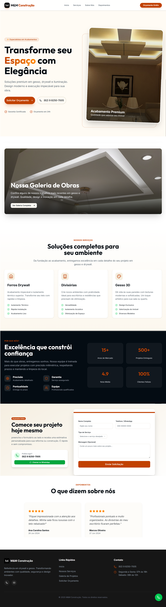

<div align="center">

# Mega Gesso – Landing Page

**Site institucional moderno, rápido e totalmente responsivo para a empresa Mega Gesso**



<a href="https://mega-gesso-landing.vercel.app" target="_blank">
  <strong>Ver demo ao vivo →</strong>
</a>

<br />
<br />


</div>

## ✨ Características

- Design 100% responsivo (mobile-first)
- Animações suaves com **Framer Motion**
- Componentes acessíveis e reutilizáveis com **Radix UI + Shadcn/UI**
- Formulários validados com **React Hook Form + Zod**
- Dark mode nativo usando **next-themes**
- Carousel moderno com **Embla Carousel**
- Performance máxima graças ao **Vite + React 19**
- Totalmente preparado para SEO e compartilhamento em redes sociais

## 🚀 Começando

### Pré-requisitos

- Node.js 18+
- pnpm (recomendado)

```bash
# Instale o pnpm caso ainda não tenha
npm install -g pnpm
Instalação e execução
Bash# 1. Clone o repositório
git clone https://github.com/seu-usuario/mega-gesso-landing.git
cd mega-gesso-landing

# 2. Instale as dependências
pnpm install

# 3. Rode o projeto em modo desenvolvimento
pnpm run dev
Abrirá automaticamente em http://localhost:5173
Outros comandos úteis
Bashpnpm run build    # gera a versão de produção
pnpm run preview  # preview da build de produção
pnpm run lint     # roda ESLint
📂 Estrutura do projeto (resumida)
textsrc/
├── components/     # componentes UI (shadcn, customizados)
├── lib/            # utils, hooks, validações
├── sections/       # seções da landing (Hero, Serviços, Galeria, etc.)
├── assets/         # imagens, ícones
└── App.tsx         # rotas e layout principal
🌙 Dark Mode
O tema escuro já vem configurado e pode ser alternado pelo botão no header.
📱
📱 Contato & Redes

Instagram: @max_moreira_gesso
WhatsApp: (inserir link ou número)
E-mail: contato@megagesso.com.br

🔧 Tecnologias utilizadas

Categoria,Tecnologia
Framework,React 19 + Vite
Estilização,Tailwind CSS 4 + Shadcn/UI + Radix UI
Animações,Framer Motion
Formulários,React Hook Form + Zod + @hookform/resolvers
Carousel,Embla Carousel
Ícones,Lucide React
Toast/Feedback,Sonner
Gerenciador,pnpm

CategoriaTecnologiaFrameworkReact 19 + ViteEstilizaçãoTailwind CSS 4 + Shadcn/UI + Radix UIAnimaçõesFramer MotionFormuláriosReact Hook Form + Zod + @hookform/resolversCarouselEmbla CarouselÍconesLucide ReactToast/FeedbackSonnerGerenciadorpnpm
🤝 Contribuição
Quer melhorar algo? Fique à vontade!

Fork o projeto
Crie sua branch (git checkout -b feature/nova-funcionalidade)
Commit suas mudanças (git commit -m 'feat: descrição')
Push para a branch (git push origin feature/nova-funcionalidade)
Abra um Pull Request